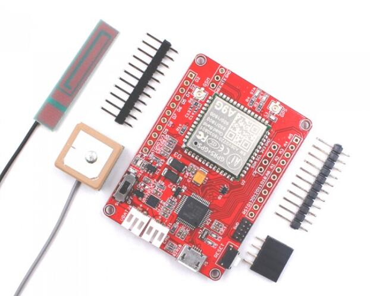

# Maduino-Zero-A9G

```c++
/*
Version:		V1.0
Author:			Vincent
Create Date:	2022/12/30
Note:
	
*/
```



[toc]

# Makerfabs

[Makerfabs home page](https://www.makerfabs.com/)

[Makerfabs Wiki](https://wiki.makerfabs.com/)

# Maduino-Zero-A9G
## Intruduce

Product Link ：[Maduino Zero GPRS/GPS A9G](https://www.makerfabs.com/maduino-zero-a9g.html) 

Wiki Link : [Maduino Zero A9G](https://wiki.makerfabs.com/Maduino_Zero_A9G.html) 

Maduino Zero A9G is an IoT (Internet of things) Solution based on the 32-bit Atmel’s SAMD21 MCU and GPRS/GSM GPS module A9G. It integrates a micro Controller ATSAMD21G18, GRRS/GSM GPS module A9G, which is the upgrade version of Maduino GPRS A7, power management and storage, to make the A9G ready for a real project for IoT projects such as smart-home, outdoor monitoring, etc. The Maduino Zero A9G is based on the Arduino, users can program it with Arduino IDE, which is very easy especially suit for the none-programmers. There are also guide for users to learn how to create the first IoT project with this board, with which the starters can learn the hardware and programming skill quickly. With this board, you will easy to add text, SMS, and data to your project. It is good for your smart home project or GPS tracker and so on.


## Feature

- BAT Input Voltage: 3.4-4.2V
- ATSAMD21G18, 32-Bit ARM Cortex M0+
- Micro SIM connector
- Integrated Power Control System
- Support AT Command
- Quad-Band: 850/900/1800/1900Mz
- Support GPS
- Support GPRS data traffic, the maximum data rate, download 85.6Kbps, upload 42.8Kbps


# Code

## Compiler Options

**If you have any questions，such as how to install the development board, how to download the code, how to install the library. Please refer to :[Makerfabs_FAQ](https://github.com/Makerfabs/Makerfabs_FAQ)**

- Install board : **Arduino Zero**.
- Upload codes, select **Arduino/Genuino Zero(Native USB port)** 